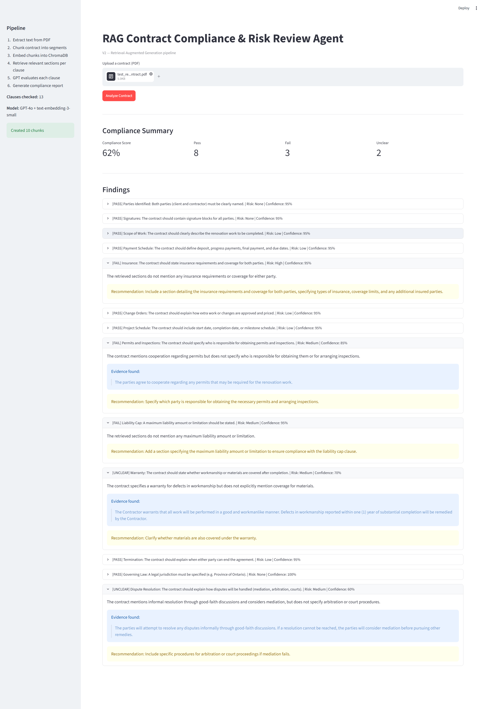
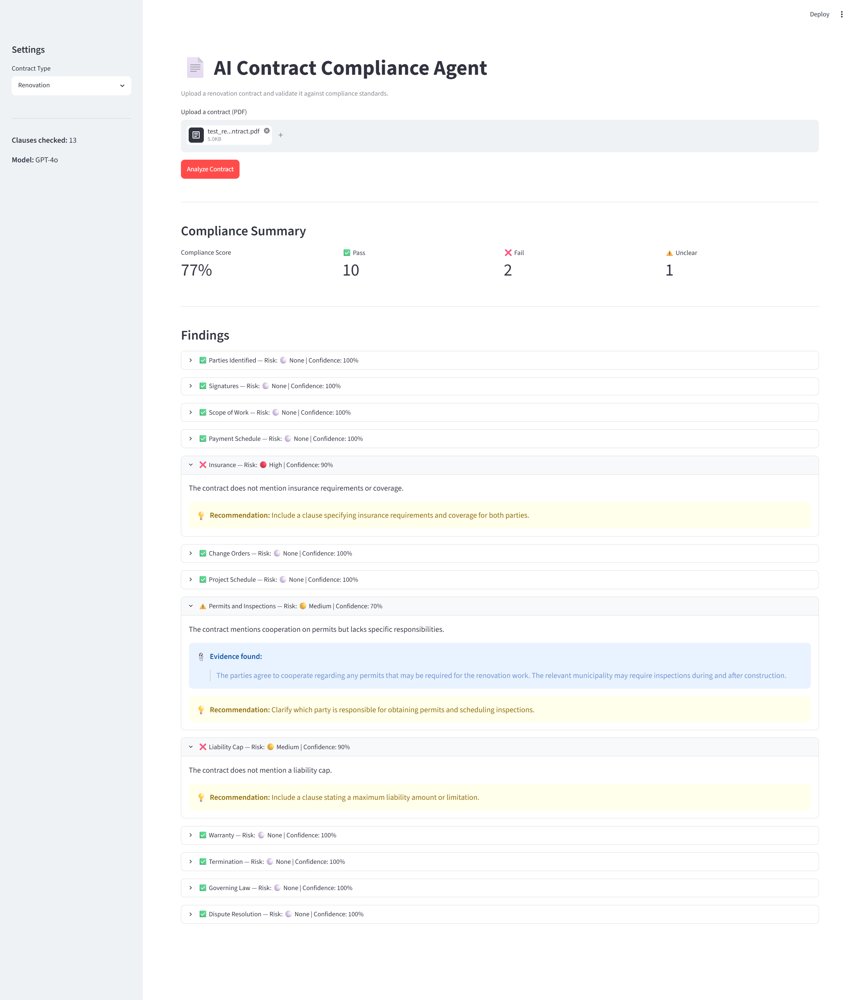

# AI Contract Compliance & Risk Review Agent


An AI-powered contract review system that demonstrates the architectural evolution from direct Large Language Model (LLM) analysis to Retrieval-Augmented Generation (RAG). Built to analyze renovation contracts, validate them against 13 predefined compliance standards, identify missing or unclear clauses, assess risk, and generate structured compliance reports with evidence.

---

## Project Motivation

Contract reviews are time-consuming and often require manually checking whether critical legal, financial, and operational clauses are present. A missing clause can expose either party to significant legal or financial risk.

This project explores how AI can assist contract review workflows by:

- Reading uploaded contract documents
- Evaluating contracts against structured compliance standards
- Identifying missing or unclear clauses
- Assessing risk levels per clause
- Generating actionable recommendations with evidence
- Producing structured compliance reports

The project is intentionally built in stages to demonstrate the progression from basic LLM applications to modern RAG architectures — showing not just how to build AI tools, but how to evaluate and improve them.

---

## Repository Structure

```
ai-contract-compliance-agent/
|
├── 01_llm_review/                  # Phase 1: Direct LLM analysis
│   ├── app.py                      # Streamlit UI
│   ├── extractor.py                # PDF text extraction
│   ├── validator.py                # GPT-4o evaluation
│   ├── standards.py                # 13 compliance rules
│   └── requirements.txt
│
├── 02_rag_review/                  # Phase 2: RAG-based analysis
│   ├── app.py                      # Streamlit UI with RAG pipeline
│   ├── extractor.py                # PDF text extraction
│   ├── chunker.py                  # LangChain text splitting
│   ├── embedder.py                 # OpenAI embeddings + ChromaDB
│   ├── retriever.py                # Semantic search per clause
│   ├── validator.py                # GPT-4o evaluation on retrieved chunks
│   ├── standards.py                # 13 compliance rules
│   └── requirements.txt
│
├── test_contracts/
│   └── test_renovation_contract.pdf
│
├── Assets/
│   ├── V1_Results.png
│   └── V2_RAG_results.png
│
└── README.md
```

---

## Project Evolution

### Phase 1 — LLM-Powered Contract Review

```
PDF Contract
      |
      v
Text Extraction (pypdf)
      |
      v
GPT-4o  (full document in context)
      |
      v
Structured Compliance Report
```

The entire contract text is sent to GPT-4o in a single prompt. GPT reads the full document and evaluates all 13 compliance clauses at once, returning a structured JSON array of findings.

This version focuses on:

- PDF document processing
- Prompt engineering
- Structured JSON outputs
- OpenAI API integration
- Risk assessment workflows
- Streamlit application development

**Key limitation:** The entire document is sent to the LLM every time. There is no retrieval mechanism, and evidence grounding relies entirely on the model's ability to locate relevant text within the full document.

---

### Phase 2 — RAG-Based Contract Review

```
PDF Contract
      |
      v
Text Extraction (pypdf)
      |
      v
Chunking (LangChain RecursiveCharacterTextSplitter)
      |
      v
Embeddings (text-embedding-3-small)
      |
      v
Vector Database (ChromaDB)
      |
      v
Retriever  (semantic search per clause)
      |
      v
GPT-4o  (evaluates only retrieved chunks)
      |
      v
Compliance Report with Evidence
```

For each compliance clause, a semantic search query is built from the clause name and description. ChromaDB retrieves the most relevant contract chunks, and GPT-4o evaluates only those chunks — not the full document.

Additional capabilities:

- Semantic retrieval via vector similarity search
- Evidence-based clause extraction
- ChromaDB vector database integration
- Retrieval-Augmented Generation (RAG)
- More precise and auditable findings

---

## Test Results — Same Contract, Both Versions

Both versions were tested on the same renovation contract (`test_renovation_contract.pdf`), designed with intentional gaps (no insurance clause, no liability cap, vague permits language, vague dispute resolution) to evaluate how each version handles missing and ambiguous content.

### Phase 1 Results

**Compliance Score: 77% — 10 Pass | 2 Fail | 1 Unclear**



| Clause | Status | Risk | Confidence |
|---|---|---|---|
| Parties Identified | Pass | None | 100% |
| Signatures | Pass | None | 100% |
| Scope of Work | Pass | None | 100% |
| Payment Schedule | Pass | None | 100% |
| Insurance | Fail | High | 90% |
| Change Orders | Pass | None | 100% |
| Project Schedule | Pass | None | 100% |
| Permits and Inspections | Unclear | Medium | 70% |
| Liability Cap | Fail | Medium | 90% |
| Warranty | Pass | None | 100% |
| Termination | Pass | None | 100% |
| Governing Law | Pass | None | 100% |
| Dispute Resolution | Pass | None | 100% |

---

### Phase 2 Results

**Compliance Score: 62% — 8 Pass | 3 Fail | 2 Unclear**



| Clause | Status | Risk | Confidence |
|---|---|---|---|
| Parties Identified | Pass | None | 99% |
| Signatures | Pass | None | 95% |
| Scope of Work | Pass | Low | 95% |
| Payment Schedule | Pass | Low | 95% |
| Insurance | Fail | High | 99% |
| Change Orders | Pass | Low | 90% |
| Project Schedule | Pass | Low | 95% |
| Permits and Inspections | Fail | Medium | 85% |
| Liability Cap | Fail | High | 95% |
| Warranty | Unclear | Medium | 70% |
| Termination | Pass | Low | 95% |
| Governing Law | Pass | None | 100% |
| Dispute Resolution | Unclear | Medium | 62% |

---

## Version Comparison

| Clause | V1 Status | V2 Status | More Accurate |
|---|---|---|---|
| Parties Identified | Pass | Pass | Agree |
| Signatures | Pass | Pass | Agree |
| Scope of Work | Pass | Pass | Agree |
| Payment Schedule | Pass | Pass | Agree |
| Insurance | Fail | Fail | Agree |
| Change Orders | Pass | Pass | Agree |
| Project Schedule | Pass | Pass | Agree |
| Permits and Inspections | Unclear | Fail | V2 |
| Liability Cap | Fail | Fail | Agree |
| Warranty | Pass | Unclear | V2 |
| Termination | Pass | Pass | Agree |
| Governing Law | Pass | Pass | Agree |
| Dispute Resolution | Pass | Unclear | V2 |

### Analysis

Both versions agreed on 10 of 13 clauses. V2 produced a more accurate finding in all 3 disagreements:

**Permits and Inspections** — V1 returned `unclear` at 70% confidence. V2 retrieved the actual vague clause text, confirmed that responsibility for permits is not assigned to either party, and correctly returned `fail` at 85% confidence. V2 is more precise because it grounds its finding in the retrieved text rather than scanning the full document.

**Warranty** — V1 returned `pass`. V2 correctly identified that while workmanship is covered for one year, materials coverage is never explicitly stated, and returned `unclear`. This is a real gap in the contract that V1 missed.

**Dispute Resolution** — V1 returned `pass`. V2 retrieved the exact clause and correctly flagged that the language ("good-faith discussions" and "consider mediation") is not sufficiently defined to be enforceable — no arbitration process, no court jurisdiction, no timeline. V2 returned `unclear`.

### Architectural Trade-offs

| Factor | V1 — LLM Review | V2 — RAG Review |
|---|---|---|
| Tokens sent to GPT | Full document every call | 3 chunks per clause |
| Cost per analysis | Higher | Lower |
| Evidence grounding | Model infers from full text | Retrieved from vector search |
| Strictness | More lenient | More precise |
| Accuracy on vague clauses | Lower | Higher |
| Architecture complexity | Simple | Moderate |
| Best suited for | Short contracts, quick checks | Scalable production use |

### Conclusion

V2 is more accurate and more cost-efficient. The lower compliance score (62% vs 77%) is not a weakness — it reflects stricter, evidence-grounded evaluation. V2 correctly identifies gaps that V1 missed because it retrieves and evaluates specific contract sections rather than relying on the model to scan the full document.

---

## Compliance Standards

The current implementation covers renovation contracts and evaluates 13 clauses across three categories.

### Legal
- Parties Identified
- Signatures
- Insurance
- Permits and Inspections
- Governing Law
- Dispute Resolution
- Termination

### Financial
- Payment Schedule
- Liability Cap

### Operational
- Scope of Work
- Change Orders
- Project Schedule
- Warranty

Each rule contains:

- Clause name and description
- Risk consequence if missing
- Default risk level (high / medium / low)
- Evidence requirement flag
- Category classification

---

## Example Output

```json
{
  "clause": "Payment Schedule",
  "status": "pass",
  "confidence_score": 94,
  "explanation": "The contract defines payment milestones and due dates.",
  "evidence": "Progress Payment 1: $14,550 due upon completion of demolition.",
  "recommendation": null,
  "assessed_risk": "none"
}
```

---

## Tech Stack

| Component | Technology |
|---|---|
| Language Model | OpenAI GPT-4o |
| Embeddings | OpenAI text-embedding-3-small |
| Vector Database | ChromaDB |
| Text Chunking | LangChain RecursiveCharacterTextSplitter |
| PDF Processing | PyPDF |
| UI Framework | Streamlit |
| Language | Python 3.11 |
| Config | python-dotenv |

---

## Setup & Installation

### 1. Clone the repository

```bash
git clone https://github.com/Bita-Fotovvat/ai-contract-compliance-agent.git
cd ai-contract-compliance-agent
```

### 2. Create and activate a virtual environment

```bash
python -m venv aicontractagent
aicontractagent\Scripts\activate        # Windows
source aicontractagent/bin/activate     # Linux / macOS
```

### 3. Install dependencies

For Phase 1:
```bash
cd 01_llm_review
pip install -r requirements.txt
```

For Phase 2:
```bash
cd 02_rag_review
pip install -r requirements.txt
```

### 4. Configure your API key

Create a `.env` file in the project root:

```
OPENAI_API_KEY=your-openai-api-key-here
```

### 5. Run the app

Phase 1:
```bash
cd 01_llm_review
streamlit run app.py
```

Phase 2:
```bash
cd 02_rag_review
streamlit run app.py
```

Open your browser at `http://localhost:8501`

---

## Skills Demonstrated

### Artificial Intelligence
- Large Language Models (LLMs)
- Retrieval-Augmented Generation (RAG)
- Prompt Engineering
- Structured JSON Outputs
- AI-Assisted Risk Assessment
- Embeddings and Semantic Search

### Data Processing
- PDF Parsing
- Document Chunking
- Vector Similarity Search
- Structured Data Extraction

### Software Development
- Python
- Streamlit
- OpenAI API
- LangChain
- ChromaDB
- Modular Application Design
- Environment Management

---

## Roadmap

### Phase 1 — LLM Review Agent (Complete)
- PDF upload and text extraction
- GPT-4o contract validation
- Risk assessment per clause
- Streamlit compliance report

### Phase 2 — RAG Review Agent (Complete)
- Document chunking with LangChain
- OpenAI embeddings (text-embedding-3-small)
- ChromaDB vector storage
- Semantic retrieval per clause
- Evidence-grounded findings

### Phase 3 — Backend Services (Planned)
- FastAPI REST API
- Separation of UI and business logic
- Endpoint-based architecture

### Phase 4 — Database Persistence (Planned)
- PostgreSQL integration
- Store scan results and history
- Audit trail per contract

### Phase 5 — Analytics Dashboard (Planned)
- Power BI connected to PostgreSQL
- Contract risk trends over time
- Most commonly missing clauses
- Compliance score distributions

### Phase 6 — Extended Contract Types (Planned)
- Employment agreements
- Lease agreements
- Vendor contracts

---

## Why This Project Matters

Many organizations review contracts manually, which is time-consuming and error-prone. This project demonstrates how AI can assist compliance workflows while also documenting a deliberate architectural progression — from a simple LLM call to a full RAG pipeline — and critically evaluating the trade-offs between the two approaches.

---

## Author

**Bita Fotovvat**

M.Eng. Systems & Technology (Co-op)
McMaster University

LinkedIn: https://www.linkedin.com/in/bita-fotovvat

GitHub: https://github.com/Bita-Fotovvat

---

## License

MIT License
